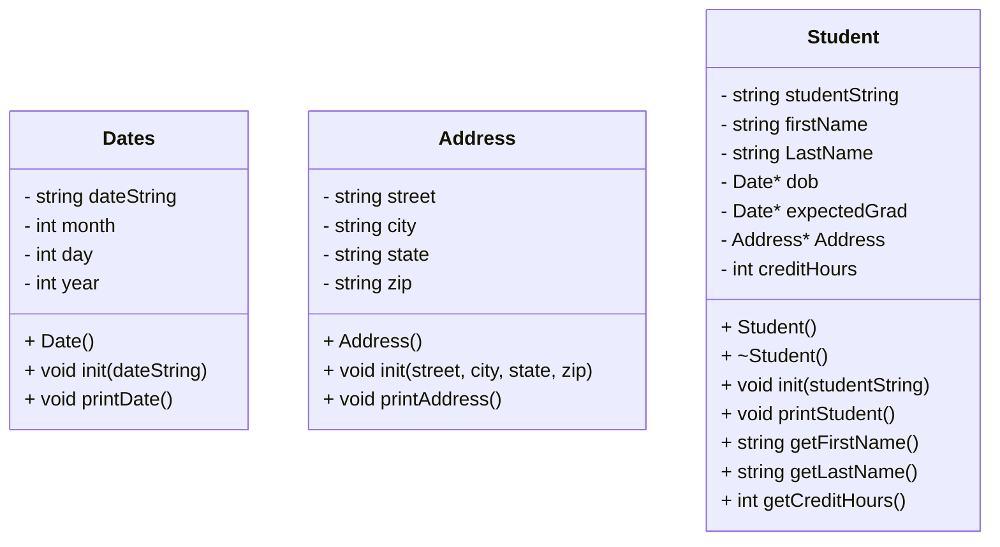

# CS121HeapofStudents

## UML

```mermaid
classDiagram

class Dates {
    - string dateString
    - int month
    - int day
    - int year

    + Date()
    + void init(dateString)
    + void printDate()
}

class Address {
    - string street
    - string city
    - string state
    - string zip

    + Address()
    + void init(street, city, state, zip)
    + void printAddress()
}

class Student {
    - string studentString
    - string firstName
    - string LastName
    - Date* dob
    - Date* expectedGrad
    - Address* Address
    - int creditHours
    
    + Student()
    + ~Student()
    + void init(studentString)
    + void printStudent()
    + string getFirstName()
    + string getLastName()
    + int getCreditHours() 
}
```
