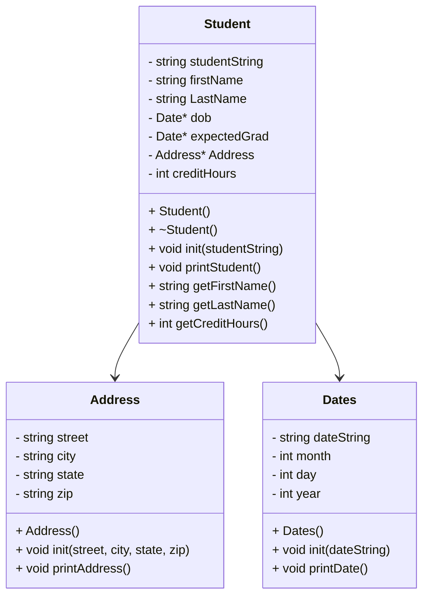

# CS121HeapofStudents

## UML



## Dates::Dates()
```
  set dateString to ""
  set month to 0
  set day to 0
  set year to 0
```

## void Dates::init(dateString)
```
  
```

## void Dates::printAddress()
```

```

## Address::Address()
```
  set street to ""
  set city to ""
  set state to ""
  set zip to ""
```

## void Address::init(street, city, state, zip)
```
  set Address::street to street
  set Address::city to city
  set Address::state to state
  set Address::zip to zip
```

## void Address::printAddress()
```
  print street and new line
  print city, state
  print zip and new line
```

## Student::Student()
```

```

## Student::~Student()
```

```

## void Student::init(studentString)
```

```

## void Student::printStudent()
```

```


